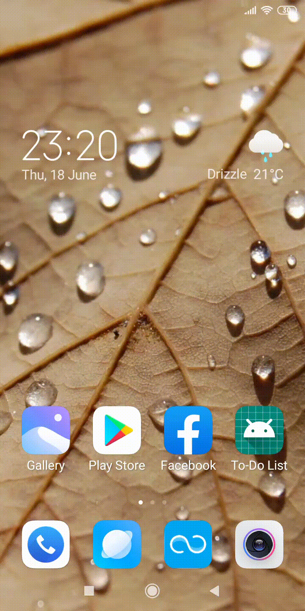
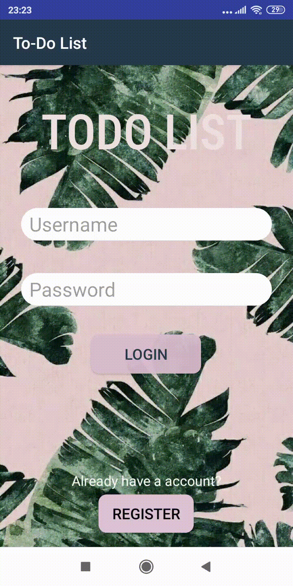
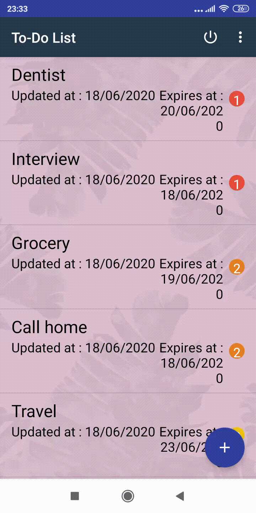
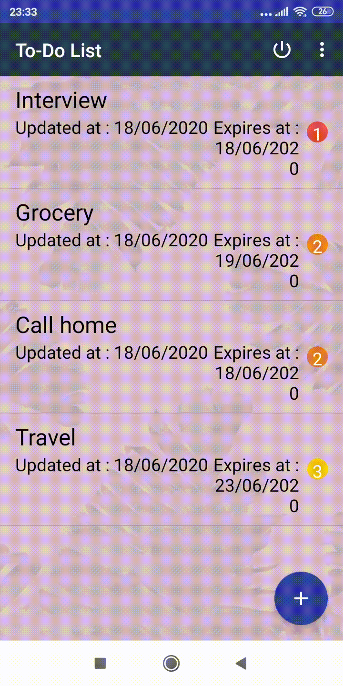
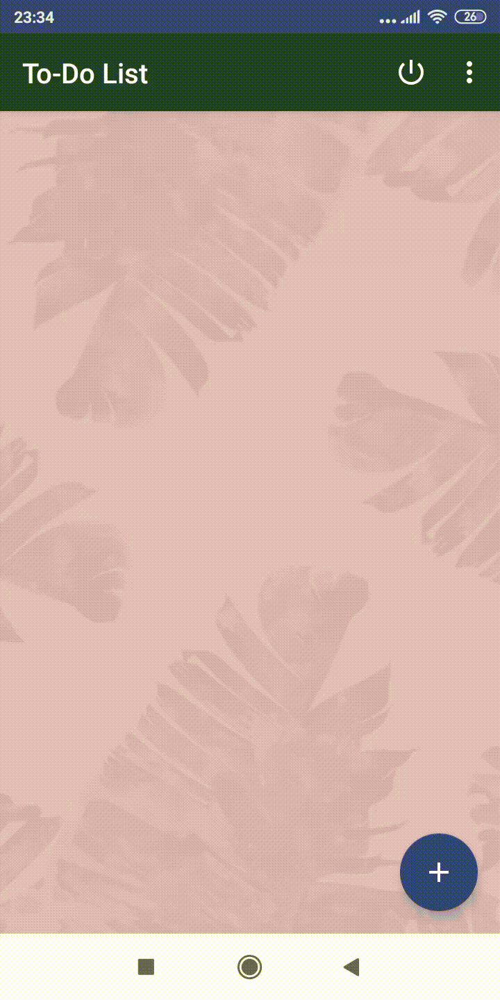

# Final Assignment - Developing Mobile Application
## TODO List

- ToDo List is a simple task managing application with different features.  
- Register and Login-In feature
- Prioritized task (high to low)
- Feature like swipe delete and undo are available.
## Splash Screen

## Register Screen

## Login Screen

## Add Task Screen

## Swipe Screen

## Undo Screen

## Delete Screen

## Logout Screen

